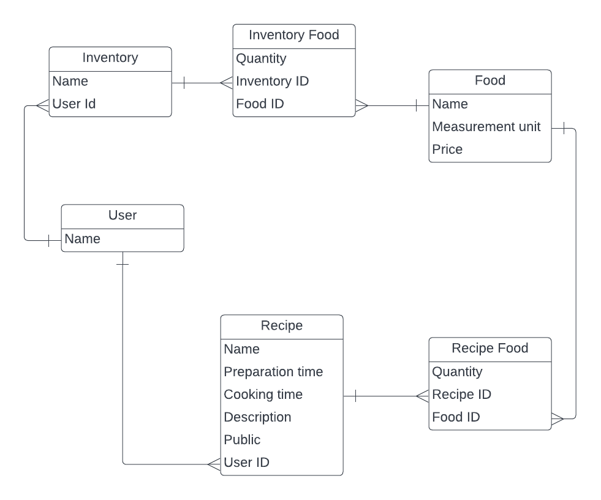

<!-- Insert an image from the current directory -->


<a name="readme-top"></a>

<!-- TABLE OF CONTENTS -->

# 📗 Table of Contents

- [📗 Table of Contents](#-table-of-contents)
- [📖 KitchenAlchemy](#-about-project-)
  - [🛠 Built With ](#-built-with-)
    - [Tech Stack ](#tech-stack-)
    - [Key Features ](#key-features-)
  - [💻 Getting Started ](#-getting-started-)
    - [Prerequisites](#prerequisites)
    - [Setup](#setup)
    - [Install](#install)
    - [Usage ](#usage-)
    - [Run tests ](#run-tests-)
    - [Deployment ](#deployment-)
  - [👥 Authors ](#-authors-)
  - [🔭 Future Features ](#-future-features-)
  - [🤝 Contributing ](#-contributing-)
  - [⭐️ Show your support ](#️-show-your-support-)
  - [🙏 Acknowledgments ](#-acknowledgments-)
  - [📝 License ](#-license-)

<!-- PROJECT DESCRIPTION -->

# 📖 [KitchenAlchemy] <a name="about-project"></a>

You are welcome to **[KitchenAlchemy]()**, where culinary possibilities turn real! This enchanting recipe app is your portal to a world of flavors and kitchen wonders. It generates a shopping list, revealing missing elements for your next creation. Explore trending recipes and favorites for enchanting ideas.

## 🛠 Built With <a name="built-with"></a>

### Tech Stack <a name="tech-stack"></a>

<details>
  <summary>Client</summary>
  <ul>
    <li>RUBY</li>
    <li>RAILS</li>
  </ul>
</details>

<!-- Features -->

### Key Features <a name="key-features"></a>

- **[Linter checks]**
- **[Add data model]**
- **[ERD]**


<p align="right">(<a href="#readme-top">back to top</a>)</p>

<!-- GETTING STARTED -->

## 💻 Getting Started <a name="getting-started"></a>

To get a local copy up and running, follow these steps.

<p align="right">(<a href="#readme-top">back to top</a>)</p>

### Prerequisites

In order to run this project you need:

<ul>
    <li>The current version of node</li>
    <li>To have Git installed on your local machine</li>
    <li>Node Package manager (npm) </li>
    <li>An editor such as Visual Studio Code</li>
  </ul>

<p align="right">(<a href="#readme-top">back to top</a>)</p>

### Setup

Clone this repository to your desired folder:

<ul>
    <li>Create your classic access token from github.com</li>
    <li>run "git clone https://{access_token}@github.com/username/{repo_name}.git"</li>
    <li>Update your git identity by running "git config --global user.email "your_email@gmail.com""</li>
    <li>Update your name on git by running "git config --global user.name "your_name"</li>
  </ul>

  <p align="right">(<a href="#readme-top">back to top</a>)</p>

### Install

To install this project, run

```sh

bundle install

```


### Run tests <a name="run-tests"></a>

To run tests, run the following command:

```sh

Run "rubocop --fix to fix linters"
```

or

```sh

Run "rubocop -A to fix linters"
```

<p align="right">(<a href="#readme-top">back to top</a>)</p>

### Deployment <a name="triangular_flag_on_post-deployment"></a>

You can deploy this project using:

- github pages
```sh
- npm run deploy
```

<p align="right">(<a href="#readme-top">back to top</a>)</p>

<!-- AUTHORS -->

## 👥 Authors <a name="authors"></a>

👤 **Author: Damilare**

- GitHub: [@githubhandle](https://github.com/Bestbynature)
- Twitter: [@twitterhandle](https://twitter.com/Dammybest)
- LinkedIn: [LinkedIn](https://www.linkedin.com/in/damilareismailabestbynature/)

<p align="right">(<a href="#readme-top">back to top</a>)</p>

<!-- FUTURE FEATURES -->

## 🔭 Future Features <a name="future-features"></a>

- [x] **[contact form page]**
- [x] **[A feature for a more detailed demographic data]**
- [x] **[A feature for updating the list of countries]**

<p align="right">(<a href="#readme-top">back to top</a>)</p>

<!-- CONTRIBUTING -->

## 🤝 Contributing <a name="contributing"></a>

Contributions, issues, and feature requests are welcome!

Feel free to check the [issues page](../../issues/).

<p align="right">(<a href="#readme-top">back to top</a>)</p>

<!-- SUPPORT -->

## ⭐️ Show your support <a name="support"></a>

If you like this project, kindly drop a star for me.

<p align="right">(<a href="#readme-top">back to top</a>)</p>

<!-- ACKNOWLEDGEMENTS -->

## 🙏 Acknowledgments <a name="acknowledgements"></a>

I would like to use this medium to appreciate [Microverse](https://microverse.org)

<p align="right">(<a href="#readme-top">back to top</a>)</p>

<!-- LICENSE -->

## 📝 License <a name="license"></a>

This project is [MIT](./LICENSE) licensed.

<p align="right">(<a href="#readme-top">back to top</a>)</p>
